# Demo walkthrough (10–15 minutes)

A scripted tour of Copper Lantern POS for showing it to an employer. It covers
two Montréal pubs, a Los Angeles bottle shop and the owner portal that sees all
three, and it ends with the part people remember: **pulling the internet and
carrying on selling**.

Everything here is fictional: the pubs, the shop, the staff, the menu and the
money.

| | Where it runs | Sign in |
| --- | --- | --- |
| **Copper Lantern — Vieux-Port** (pub) | the Android tablet | PIN `1234` manager, `9999` server |
| **Copper Lantern — Plateau** (pub) | this Mac, `:8080` | same PINs |
| **Sage & Poppy Bottle Shop** (US shop) | this Mac, `:8082`, counter screen in Chrome | `1234` manager, `9999` cashier, `5555` Spanish-speaking cashier |
| **Owner portal** | the hosted portal (all stores, CAD + USD) | your portal login + authenticator code |

---

## Before the meeting

### The evening before

- [ ] **Reset the Mac stores** so the sales look like a normal couple of days:
      ```sh
      scripts/demo-reset.sh --store plateau        # read the plan
      scripts/demo-reset.sh --store plateau --yes  # do it
      scripts/demo-reset.sh --store sage-poppy --yes
      ```
      Each run backs up first, rebuilds the store from its built-in menu, adds
      two days of sales in the store's own currency and time zone, opens today's
      shift, and restarts with the same settings. It takes about 30 seconds per store.
- [ ] **Hosted portal (optional, done by hand):** the portal keeps every old
      sale. The reset prints which old check numbers are "before the reset". If you
      want only the fresh days to show, clean those up on the hosted database
      yourself. The script never deletes cloud data.
- [ ] **Tablet:** close or void any tables left open from rehearsals. On the
      tablet, open the table, then Pay or void it. `scripts/demo-reset.sh --store tablet --yes` lists
      the open tables and restarts the app, but it **does not** wipe the tablet's
      sales (see "What the reset does" at the end).
- [ ] **Autostart** (once): `scripts/demo-autostart.sh install` starts both Mac
      stores at login, so a reboot doesn't cost you the demo.

### An hour before

- [ ] **Router on.** The tablet, this Mac and the printer are all on its Wi-Fi.
      Find the router's **WAN / internet cable**, the one going to the modem.
      That's the cable you pull in beat 5. Don't pull the power.
- [ ] **Printer paper:** there's a roll in, the printer is on, and a test print works
      (tablet → More → Venue settings → Receipt printer → Test print).
- [ ] **Tablet charged**, with the charger in the bag. The POS app is open on the floor plan.
- [ ] **Stores up:** `scripts/demo-autostart.sh status` shows both `up`.
- [ ] **Counter screen** for the bottle shop, in Chrome on this Mac:
      `cd client && flutter run -d chrome --dart-define=SERVER_URL=http://localhost:8082`
- [ ] **Portal logged in** on this Mac's browser **and on your phone**. Turn the phone's
      Wi-Fi off so it's on cellular, because you'll watch the portal from it
      while the router's internet is unplugged.
- [ ] **A guest phone** (yours works) for scanning a table QR.
- [ ] Portal date range on **Today**. Check that the store cards say **Online**.

---

## 1. The pub tablet (about 4 min)

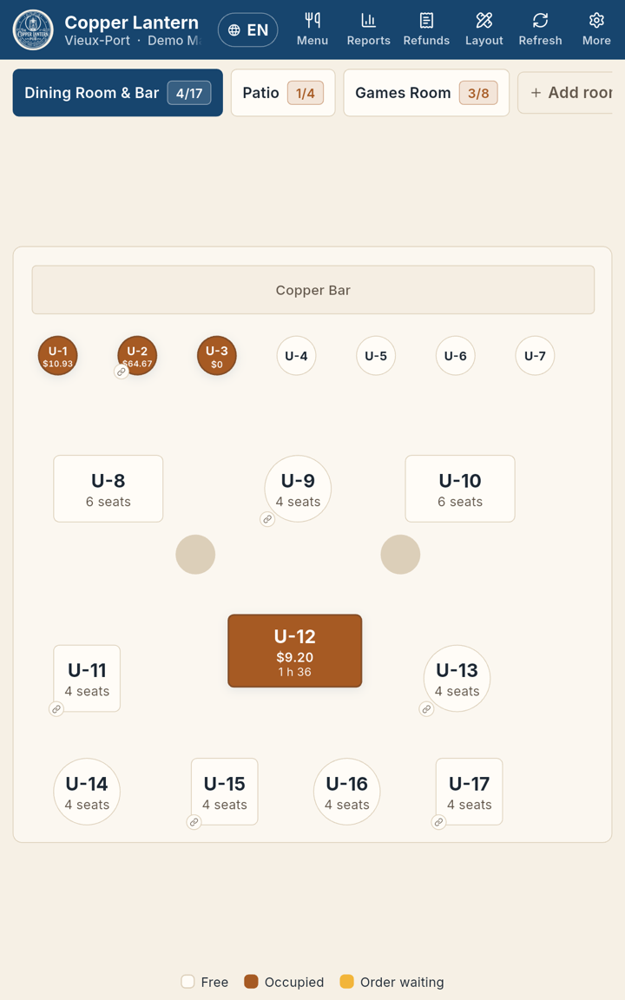

**Say:** "This is a pub in Old Montréal on a normal Android tablet. The whole
restaurant runs on the tablet itself. There's no server in a back room, and it
doesn't need the internet to take money."

1. **Sign in** with `9999` (Demo Server). The PIN signs you in on the 4th digit.
2. **Tables.** Show the rooms along the top ("Dining Room & Bar", "Patio",
   "Games Room") and the legend "Free / Occupied / Order waiting". An open table
   shows its running total and how long it's been open.
3. **Order.** Tap a free table and add two drinks and two mains. A drink with sizes
   opens a size sheet, and there's a note field ("no ice"). The items go straight on the bill.
   - *If asked about the kitchen:* there is **no kitchen screen or kitchen ticket
     yet**. Don't promise one. What prints today: the bill, the receipt, table QR
     slips and Wi-Fi slips.
4. **Printer.** Tap **Print bill**. A provisional bill comes out marked
   "NOT A RECEIPT / Pas un reçu", and a preview shows on screen.
5. **Québec taxes.** Point at the totals: Subtotal, **GST 5%**, **QST 9.975%**,
   Total. Tap the EN/FR pill to show "TPS / TVQ" in French. The printed receipt
   carries the tax registration numbers.
6. **Split the bill.** Tap the split icon (it has no text label). "Bill 1" and
   "Bill 2" appear. Tap a bill, then tap items under "Unassigned" to move them.
   (Or **Split evenly** → 2–9 ways.) Each part has its own **Pay**.
7. **Cash rounding.** Pay one part in **Cash**. The screen shows "Rounding −0.02"
   and a "Cash total" ending in 0 or 5. **Say:** "Canada dropped the penny, so cash
   rounds to the nickel. Card doesn't."
8. **Receipt.** When the bill is paid, the receipt prints and shows on screen
   ("Receipt — Bill #…"). Its language follows the server who opened the table.
9. **Table QR ordering, with the Wi-Fi slip.**

   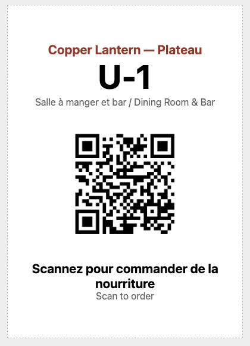

   - Long-press a table, then tap **Print QR code**. When guest Wi-Fi is set
     (More → Venue settings → Guest Wi-Fi), the slip has two steps: **1. Join Wi-Fi**
     (a Wi-Fi QR with the network and password) and **2. Scan to order**. Guests
     never type a password.
   - On your phone, scan the slip. The menu opens with photos, in English with a
     "français" switch. Add something, then tap **Send order**.

     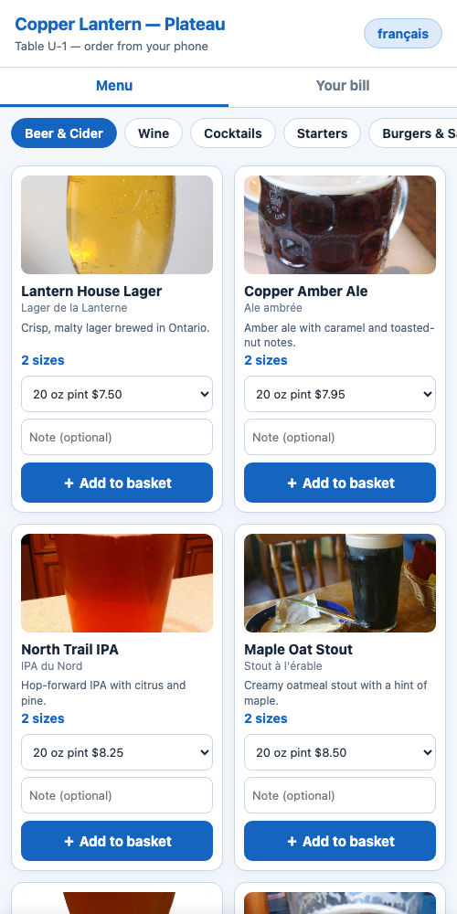

   - Back on the tablet the table turns **Order waiting**, and the bill shows an amber
     bar "Ordered from phone — awaiting confirm". Tap the green tick to accept.
     **Say:** "Guests can't put anything on a bill by themselves. A server
     confirms it, and nobody can pay until it's confirmed."

## 2. The staff phone app (about 1½ min)

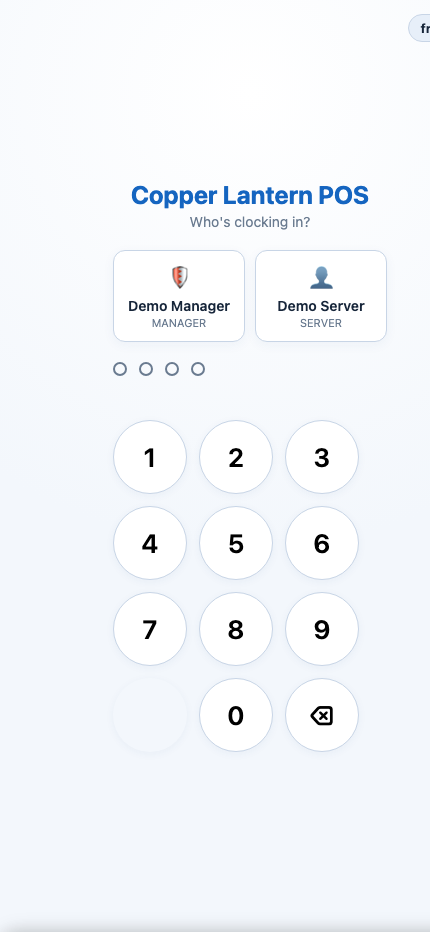

**Say:** "Servers can carry a phone instead of walking back to the tablet."

1. On the tablet: More → Venue settings → **Staff app**, then scan the
   "Staff ordering app" QR with your phone. The phone must be on the pub's Wi-Fi.
2. Sign in with `9999`. The demo stores have the extra authenticator code
   turned off, so it's PIN only.
3. Show **Tables**, open the table from beat 1, **＋ Add items** → **Add to bill**.
   The tablet shows it at once. Show **Pending** for guest phone orders.

## 3. The bottle shop (about 3 min)

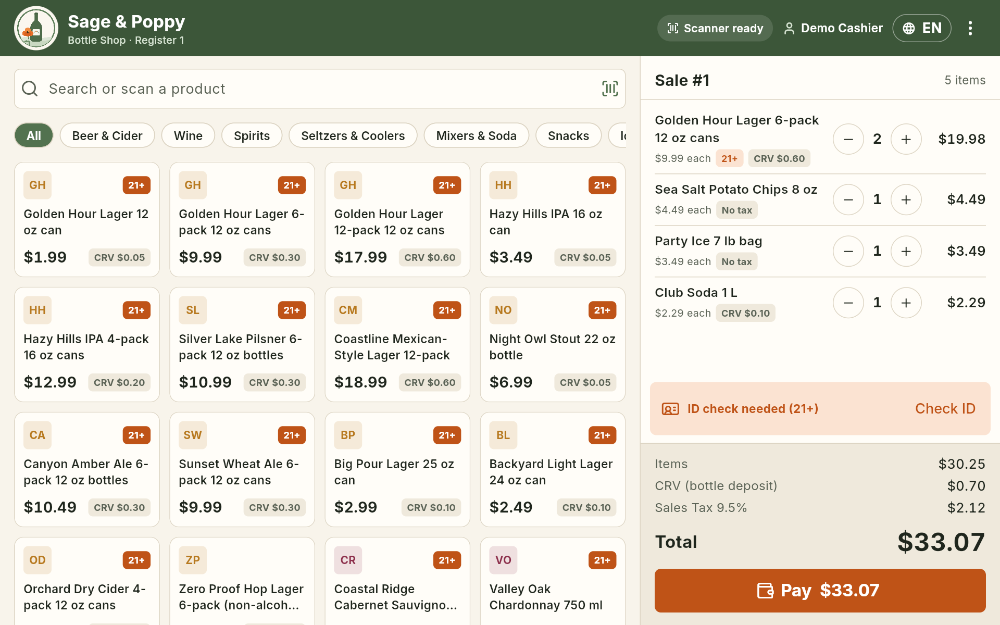

**Say:** "Same product, a completely different business: a Los Angeles liquor
store, in US dollars, with California's rules."

1. In Chrome, sign in with `9999`.
2. **Scan.** Use the barcode scanner, or type `487230001029` in the search box
   and press Enter (Golden Hour Lager 6-pack). Scan it again and the quantity goes up.
3. **CRV.** Point at the "CRV (bottle deposit)" line. It's California's
   container deposit, charged per can, on its own line and never taxed. Then the
   **Sales Tax 9.5%** line (snacks and ice are exempt).
4. **Age check.** The basket says "ID check needed (21+)". Tap **Pay** and the ID
   check opens.
   - **ID scan:** a 2D scanner reads the barcode on the back of a driver's licence
     and the age is worked out for you.
     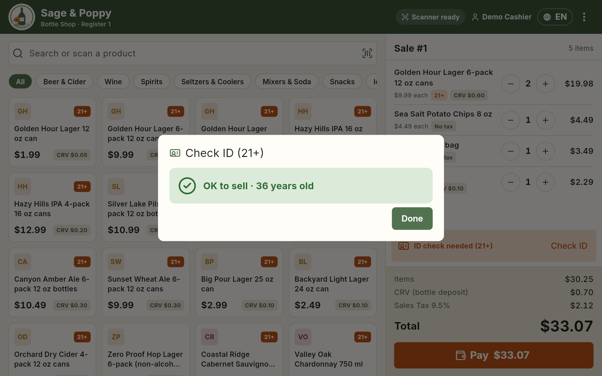
   - **Date-of-birth fallback:** pick Month / Day / Year and tick **"I have seen
     the customer's ID"**. **Verify** stays greyed out until it's ticked. Show it
     failing with a 19-year-old ("do not sell alcohol"), then **Remove age-restricted
     items** and sell the rest.
     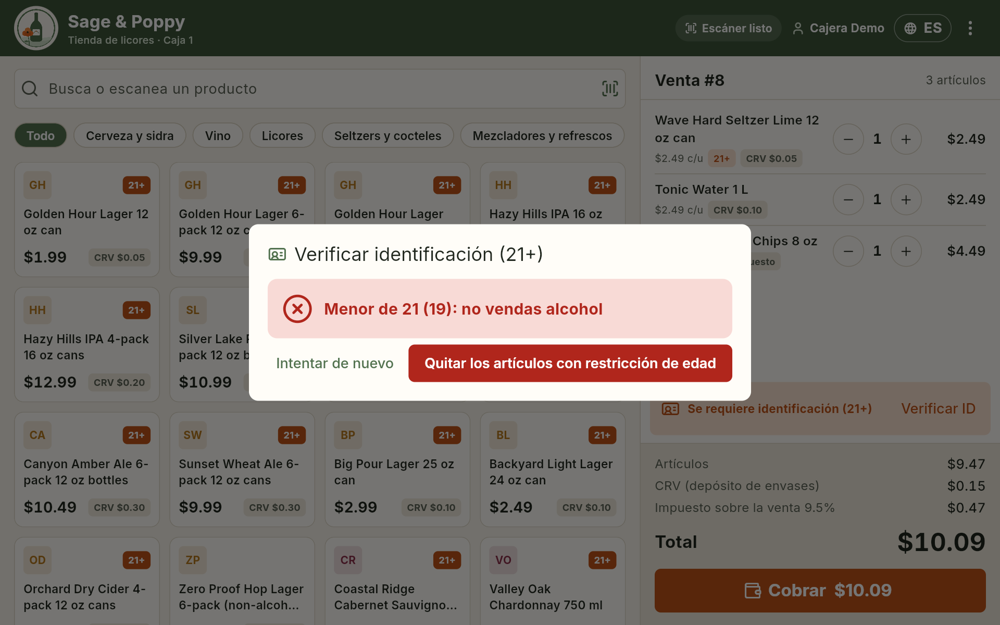
   - **Say:** "We keep that a check happened and its outcome, not the customer's
     birthday."
5. Pay **Cash** (rounded to the nickel here too) or **Card** (the shop's own terminal).
6. **Spanish.** Sign out and sign in as `5555` (Cajera Demo). The counter switches
   to Spanish and her receipts print in Spanish, e.g. "CRV (depósito de envases)".
   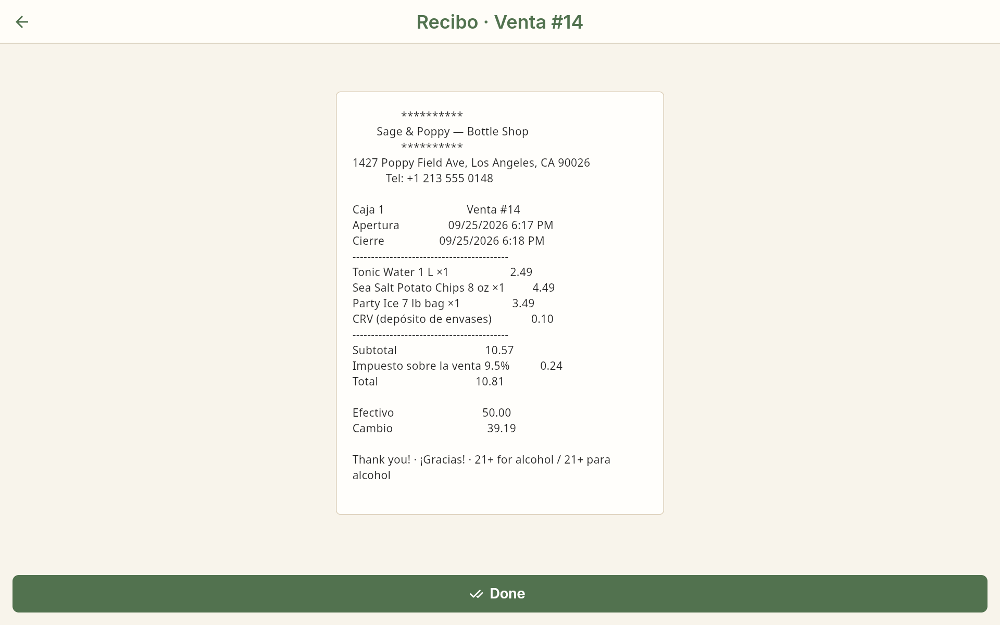

## 4. The owner portal (about 3 min)

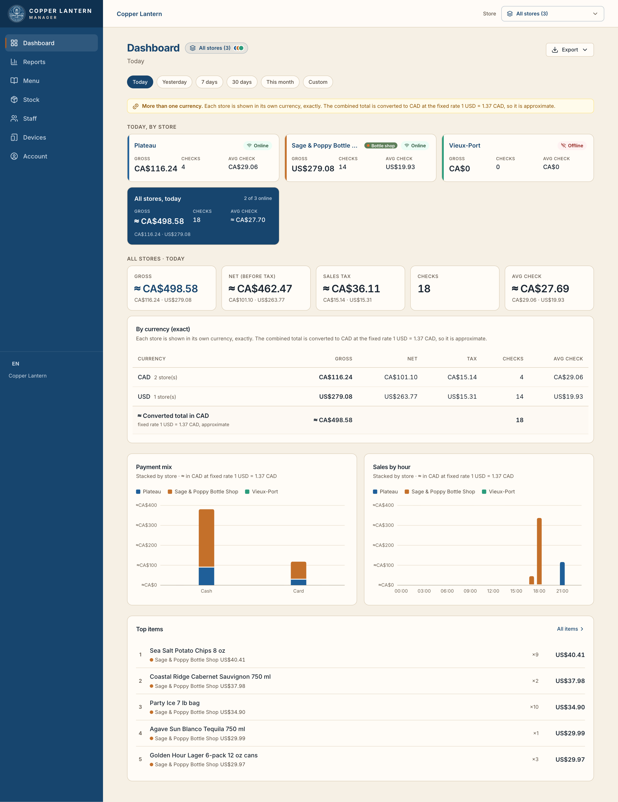

**Say:** "The owner sees every store from anywhere. The stores send their sales
up. The portal can't change a sale, and it never has to be up for a store to sell."

1. **All stores vs one store.** The picker at the top says "All stores (3)". Each store card
   shows today in its **own currency** (CA$ for the pubs, US$ for the shop). The
   combined figure is marked "≈" and converted to CAD at a fixed rate. Next to
   it, "By currency (exact)" never mixes the two. Pick **Sage & Poppy**: everything
   is in US$.
2. **Tax report.** Reports → **Sales tax**: GST and QST by day for a pub; switch to
   the shop for US sales tax. Show the cash-rounding note.
   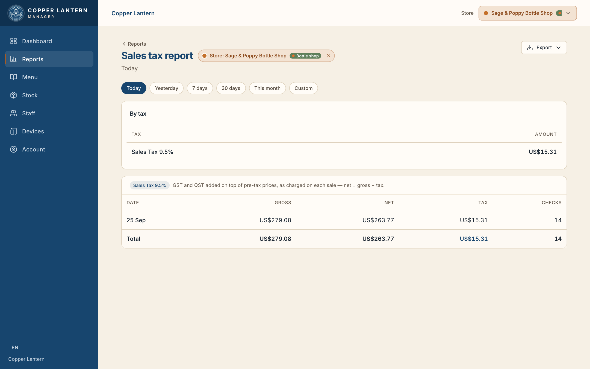
3. **Stock** (shops only): with Sage & Poppy picked, show on-hand units and low
   stock, and **Receive** for a delivery.
   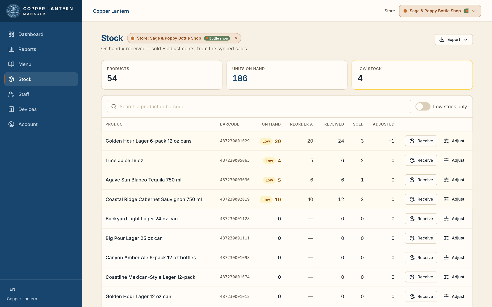
4. **Devices.** "Store POS" lists each store as **Online / Delayed / Offline** with
   "Last seen". Under it are the extra terminals paired to a store.
5. **Remote lock.** On an extra paired terminal, tap **Revoke** → confirm. "The
   store confirms within a few seconds." The terminal is signed out. The store's own
   tablet isn't in that list, on purpose, so you can't lock yourself out of the till.
   *Rehearse this one first. It needs an extra terminal paired beforehand
   ("Generate pairing code").*

## 5. The offline proof (about 2½ min)

**Say:** "Here's the part that matters most in a real bar: the internet drops on
a Friday night."

1. On your **phone (cellular)**, show the portal: all stores **Online**.
2. **Unplug the router's WAN / internet cable.** Leave the router on, because the
   tablet, the Mac and the printer still talk to each other over its Wi-Fi.
   **Say:** "The internet's gone. The pub hasn't noticed."
3. **Keep selling:**
   - Tablet: open a table, add two items, pay **Cash**. The receipt prints.
   - Counter: scan a six-pack, do the age check, pay.
   - The staff phone app keeps working too, because it's on the pub's Wi-Fi.
   - Nothing shows an error and nothing waits. (There is no "offline" banner on
     the tablet, and that's the point.)
4. After about a minute, the phone's portal shows the stores as **Delayed**
   (amber). **Say:** "The owner can see the shop has lost the internet, but nobody
   in the shop is blocked."
5. **Plug the cable back in.** Give the router 30–60 seconds to get back online.
   The stores check in every 10 seconds and send everything they sold meanwhile.
6. Refresh the portal on the phone: the stores go back to **Online**, and today's
   totals now include the sales you just made offline, in the right order and
   with the right times. **Say:** "Nothing was lost and nothing was typed in twice.
   The shop just caught the portal up."

## 6. If something breaks mid-demo

Stay calm and keep talking. Every one of these is quick.

| What you see | Do this |
| --- | --- |
| Tablet: dark screen "Reconnecting to your restaurant…" | Tap **Retry**. Still stuck: swipe the POS app away and reopen it. Its data is safe. |
| **Pay** is greyed out and says "Orders awaiting confirm" | A phone order is waiting. Accept (green tick) or reject (red) the amber lines. |
| Taking money says a shift must be open | Reports → **Open shift**. (The reset opens today's shift on the Mac stores.) |
| "Print failed — printer offline" | Carry on. The sale is saved. Check the printer's power, paper and Wi-Fi, then use **Print again**. |
| Age check **Verify** won't light up | Tick "I have seen the customer's ID". |
| Staff phone asks for a 6-digit code | The tablet has staff-app MFA on: `scripts/tablet-staff-mfa.sh off` (restarts the app). |
| A Mac store isn't answering (Chrome counter shows reconnecting) | `scripts/demo-autostart.sh status`, then `scripts/demo-autostart.sh restart --store sage-poppy` (or `plateau`). About 10 seconds. |
| Portal says a store is **Delayed / Offline** when it shouldn't be | The store still sells. Check that this Mac or the tablet is on the router's Wi-Fi and the router has internet. It catches up by itself. |
| Portal numbers look odd (old test sales) | Set the range to **Today** or pick one store. The old history is still on the hosted portal (see the evening-before checklist). |
| The guest's phone won't open the menu from the slip | The phone must be on the pub's Wi-Fi. Scan step 1 on the slip first. |
| Everything is a mess | Show the portal and the offline proof. Afterwards: `scripts/demo-reset.sh --store <store> --yes`. |

---

## What the reset does (and doesn't)

`scripts/demo-reset.sh --store plateau|sage-poppy|tablet|all [--hosted|--local|--offline] [--yes]`

- It **always prints the plan first** and changes nothing without `--yes`.
- **Mac stores:**
  1. Stop the store and back up its database, photos, receipts and settings to
     `.demo/<data dir>/backups/<time>/`.
  2. Rebuild the database from the built-in menu, keeping the store's cloud
     identity, its check numbering and its venue settings (Wi-Fi slip, printer,
     receipt footer).
  3. Put the menu photos back.
  4. Ring up two days of believable sales (lunch and dinner rushes for the pub,
     after-work for the shop), with one shift per day counted and closed, and
     open today's shift.
  5. Restart with the same settings: staff app MFA off, digital receipts, and the
     same cloud URL and key.

  The first run copies the running store's settings into `.demo/<store>/store.env`
  (gitignored; it holds the cloud key).
- **The tablet:** a safe reset only. It copies `store.properties` to this Mac
  (read-only), lists open tables and restarts the POS app. It **never** wipes the
  tablet's sales. adb can't write a release app's private files, and clearing
  the app's data would also delete `store.properties` and the store's cloud
  identity.
- **Hosted portal:** keeps its old history. The reset prints what the portal will
  show and which check numbers are pre-reset. Cleaning those off the hosted
  database is a manual step.
