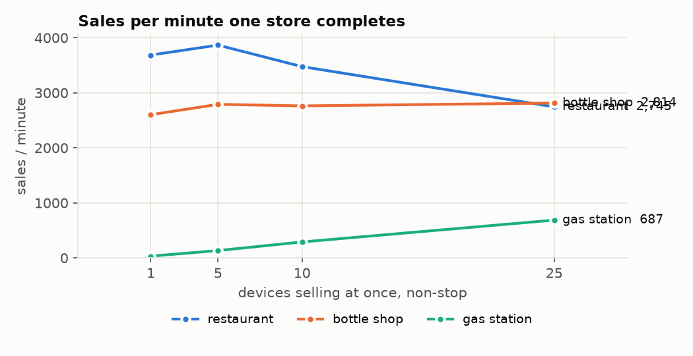
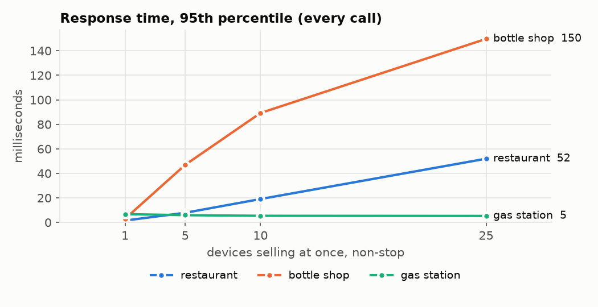
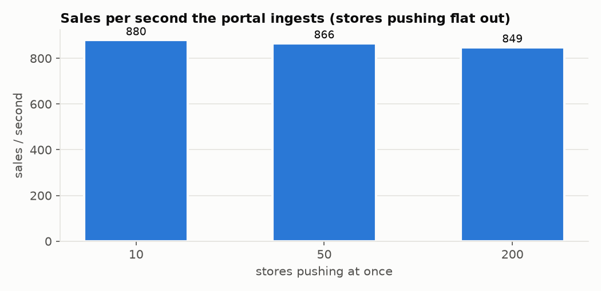
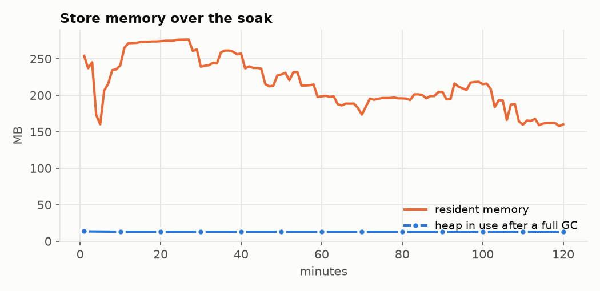

# Load test report

Commit `295ea31` · generated 2026-09-26 21:24 · Apple M4, 10 cores, 16 GB, macOS 15.4.1 · regenerate with `scripts/load-test.sh all`

Everything ran on this one machine: the store server jar (the same code the tablet embeds), the forecourt simulator, and a local cloud (Postgres in Docker, limited to 2 CPUs and 2 GB, and the cloud API with the production 512 MB heap). No hosted server was touched. A tablet has a slower processor and storage than this Mac, so read the store numbers as what the software can do, not as tablet numbers; the headroom below is large enough that a tablet several times slower still has plenty.

## Headlines

- **Restaurant (Copper Lantern):** one store completes **2,745 sales a minute with 25 devices** selling non-stop, every call answered at **p95 52 ms**, with 0 failed sales and 0 errors.
- **Bottle shop (Sage & Poppy, 5,000 products):** one store completes **2,814 sales a minute with 25 devices** selling non-stop, every call answered at **p95 150 ms**, with 0 failed sales and 0 errors.
- **Gas station (Pronghorn, pumps + shop):** one store completes **687 sales a minute with 25 devices** selling non-stop, every call answered at **p95 5.3 ms**, with 0 failed sales and 0 errors. The pumps set the pace here (each fill takes a few seconds even at 20× speed), not the store.
- **A year of sales, restaurant:** 100,050 sales make a **1,106 MB** database (~10.8 KB a sale). On it, 10 devices still get p95 **26 ms** (p95 19 ms on a fresh database).
- **A year of sales, bottle shop:** 100,197 sales make a **596 MB** database (~5.8 KB a sale). On it, 10 devices still get p95 **83 ms** (p95 89 ms on a fresh database).
- **A year of sales, gas station:** 100,102 sales make a **475 MB** database (~4.6 KB a sale). On it, 10 devices still get p95 **214 ms** (p95 5.4 ms on a fresh database). This run predates the forecourt fix below (4b360b9), which brings it to p95 8 ms; the next `scripts/load-test.sh all` will show it.
- **The portal ingests 849 sales a second (9,525 events) from 200 stores** pushing flat out, with 0 failed pushes.
- **200 stores at a busy real pace** (6 sales a minute each, pushing every 10 s): a push takes p50 24 ms, p95 42 ms; the cloud API used 10% of one core.
- **Nothing lost, nothing counted twice:** 1,811,868 of 1,811,868 events and 163,848 of 163,848 sales arrived, 117,803 deliberately re-sent events were all recognised as duplicates — **all checks pass**.
- **A store back after being offline** with 1,786 sales (27,362 events) waiting caught up in **32.1 s**, with its first acknowledgements lost on the way; the portal's sales and totals match the store's exactly: **yes**.
- **Portal over 201 stores × 365 days** (7,502,134 sales): the dashboard loads in **4.6 s** for today across all stores, 48.4 s for a whole year across all stores, 225 ms for one store's year.
- **Soak, 120 minutes at five times demo pace** (1,800 sales, synced): heap after GC changed by 0.0 MB an hour, p95 went 8.3 ms → 6.7 ms, threads 50 → 50, open files 109 → 109; 0 failed sales, 1,800 in the portal. **No leak.**

For scale: a busy cashier rings about one sale a minute, so 25 devices at a real pace is ~25 sales a minute. The devices here have no think time at all.

## What we fixed

Found by this load test, fixed with tests, one commit each. Before/after on this Mac, same driver.

**Sales failed with "database is locked" as soon as two devices sold at once.** Most POS actions read and then write. SQLite cannot turn a stale read into a write, so whenever another device had written in between, the action failed at once with SQLITE_BUSY (a 500). The store now runs one transaction at a time, first come first served, on one long-lived connection, and starts each transaction with the write lock.

- Before: Restaurant flow: 10 devices lost 35% of their sales, 25 devices lost 87% (273 sales/min got through).
- After: No failed sales at 1, 10 or 25 devices; 25 devices ring about 2,300 sales/min.
- `server/.../db/OneWriterDataSource.kt`, test `OneWriterDataSourceTest`

**Every scan read the whole 5,000-product catalog.** To decide whether a line shows its size, every check view, receipt, closed-sale event and kitchen ticket loaded every size of every product. It now counts sizes for the items on that check only.

- Before: Bottle shop, 1 device: 720 sales/min; a scan took 7.3 ms.
- After: 2,700 sales/min; a scan takes 0.9 ms.
- `server/.../restaurant/VariantCounts.kt`, test `VariantCountsTest`

**A sign-in or manager approval froze the store for up to a second.** A PIN is checked with bcrypt against each staff member in turn (about 30 ms each here, more on a tablet). That ran inside the database transaction, so with transactions taking turns every other device waited for the whole scan. The PIN is now checked after the transaction. A manager approval also checked the PIN against every staff member, even after a match; it now checks only the staff who can approve.

- Before: With 27 staff, a manager-PIN approval did 27 bcrypt checks (~0.8 s) while holding the database.
- After: An approval does 1-2 checks; other devices keep selling during a sign-in.
- `server/.../base/AuthService.kt`, test `PinCheckOutsideTransactionTest`

**The store's memory grew with every sale.** Found while soaking the first fix: on its one long-lived database connection the store kept about 25 KB a sale (the driver holds what unclosed statements keep until its connection closes). The connection is now reopened every 500 transactions, which costs about a millisecond.

- Before: 5 devices, 8,700 sales: resident memory 355 → 596 MB, heap after GC 21 → 40 MB, still rising.
- After: Same run: 336 MB and 17.5 MB, flat, same throughput (the soak below is 2 hours of it).
- `server/.../db/OneWriterDataSource.kt`, test `OneWriterDataSourceTest`

**Split checks slowed down as history grew.** Every view, payment and close of a split check looked up its groups' payments and its lines' allocations with no index, reading the whole table each time.

- Before: Restaurant with a year of sales, 10 devices: 670 sales/min, p95 124 ms.
- After: 2,170 sales/min, p95 29 ms.
- `server/src/main/resources/migrations/049_split_indexes.sql`, test `SplitIndexesTest`

**The gas station slowed down as its fuel history grew.** Every forecourt poll (every 300 ms) read every fuelling the store had ever sold, and the pump screen and the poll looked for open fuellings with no index. Now the poll looks up only what the controller currently holds, and two indexes cover the open-fuelling lookups.

- Before: Gas station with a year of sales (68,000 fuellings), 10 devices: p95 214 ms (fresh store: 5 ms).
- After: p95 8 ms.
- `server/.../forecourt/ForecourtService.kt`, `.../migrations/050_fuel_sales_indexes.sql`, test `SplitIndexesTest`

**A year's sales report ran the store out of memory.** The X / Z report and the date-range report loaded every sale of the range, then its payments and lines. They are now sums in SQLite.

- Before: Restaurant with a year of sales (100,000): the year's range report failed with "Java heap space" (on a tablet that is an app crash).
- After: The same report answers (see the history table below).
- `server/.../restaurant/ShiftService.kt`, test `RangeReportScaleTest`

**The portal's "All stores" dashboard crashed the cloud API with 200 stores.** Every dashboard call read every sale in range into the API (512 MB) and added them up there. It now asks Postgres for the sums, grouped by store and business day (or hour, tender type, item), and does the same per-currency arithmetic on those; a new index covers sales by store and closing time. The reports that still add up single sales (categories, fuel, tables, exceptions) now answer "too many sales, pick fewer days or one store" above 150,000 sales instead of crashing.

- Before: 200 stores, one busy day (111,000 sales): the API ran out of memory and restarted, for every range.
- After: Same database: today 7 s, 30 days 30 s, a year 72 s; one store, any range, under 0.4 s; no crash.
- `cloud/api/.../reports/Reports.kt`, `cloud/migrations/025_report_indexes.sql`, test `ReportScaleTest`

### Found, not changed

- **All-stores reports over long ranges are slow on a small database.** With 200 stores × a year (7.3 million sales, ~11 GB) on a 2-CPU / 2 GB Postgres, the all-stores dashboard reads gigabytes for a year (see section 4). The next step, if clients this size are expected, is a daily roll-up table per store kept up to date on ingest, and a bigger database box; the fuel/margin, categories and tables reports should move to summed queries too (today they refuse more than 150,000 sales in scope, so the gas station fuel card on an all-stores dashboard shows that message for long ranges).
- **Leave a Mac awake during a load test.** A Mac left alone goes to sleep and freezes every process for minutes, which looks exactly like a server stall (it did, on the first run). `scripts/load-test.sh` now runs under `caffeinate`.
- **The sync outbox is most of the store's database.** Every event a store sends to its portal stays in `sync_outbox` after the portal has it. In these runs it is 65-85% of the file. It is harmless for years on a tablet, but backups and copies grow with it. Pruning acknowledged events older than, say, 90 days would cut the file by about two thirds; it also removes the ability to replay history from the tablet into a rebuilt portal, so it is a decision, not a fix. Not changed.
- **A PIN sign-in gets slower with every staff member.** PIN-only sign-in has to try the PIN against each staff member's bcrypt hash: ~30 ms per person on this Mac, several times that on a tablet. With 28 staff the slowest sign-in takes about 1.5 s here while the store is busy (see "sign-in during load"). Fine for a store's own staff; a very large store would want a staff picker before the PIN. Not changed.









## Details

### 1. One store, N devices

Each device signs in as its own cashier and sells in a loop, with no pause between sales. **Restaurant:** open a check, add 3-6 items, send to the kitchen, look at the check, add 1-2 more, send again, print the bill, then pay (30% split two ways and paid by group; else 60% card, 40% cash) and close; a kitchen screen polls every 2 s and bumps what it shows. **Bottle shop:** scan 1-8 barcodes by sales weight (the real long tail), search the catalog on 35% of sales, ID check when there is alcohol, pay, close. **Gas station:** 50% postpay (authorise the pump, the simulator fills 5-14 gal, pay inside with 0-3 shop items), 20% prepay (pay first, pump, change back), 30% shop only. The bottle shop and gas station have one register per tablet in the app; the extra devices sell on extra counter lanes against the same store. Meanwhile someone signs in every 3 s.

| store | devices | sales/min | requests/s | p50 | p95 | p99 | errors | failed sales | CPU avg (1 core = 100%) | memory max | sign-in during load (p50) |
|---|---:|---:|---:|---:|---:|---:|---:|---:|---:|---:|---:|
| restaurant | 1 | 3,686 | 1,194 | 0.8 ms | 1.5 ms | 4.1 ms | 0 | 0 | 128% | 384 MB | 1,646 ms |
| restaurant | 5 | 3,867 | 1,223 | 4.1 ms | 7.8 ms | 10 ms | 0 | 0 | 139% | 388 MB | 1,659 ms |
| restaurant | 10 | 3,476 | 1,026 | 9.6 ms | 19 ms | 24 ms | 0 | 0 | 137% | 389 MB | 1,665 ms |
| restaurant | 25 | 2,745 | 794 | 31 ms | 52 ms | 62 ms | 0 | 0 | 135% | 407 MB | 1,676 ms |
| bottle shop | 1 | 2,602 | 361 | 0.9 ms | 2.9 ms | 42 ms | 0 | 0 | 138% | 450 MB | 1,736 ms |
| bottle shop | 5 | 2,790 | 388 | 4.7 ms | 47 ms | 86 ms | 0 | 0 | 137% | 452 MB | 1,750 ms |
| bottle shop | 10 | 2,762 | 385 | 11 ms | 89 ms | 99 ms | 0 | 0 | 137% | 454 MB | 1,764 ms |
| bottle shop | 25 | 2,814 | 395 | 59 ms | 150 ms | 198 ms | 0 | 0 | 136% | 456 MB | 1,787 ms |
| gas station | 1 | 32 | 4 | 1.8 ms | 6.8 ms | 9.4 ms | 0 | 0 | 39% | 339 MB | 1,552 ms |
| gas station | 5 | 134 | 19 | 1.9 ms | 5.9 ms | 8.5 ms | 0 | 0 | 41% | 343 MB | 1,556 ms |
| gas station | 10 | 290 | 41 | 1.6 ms | 5.4 ms | 7.9 ms | 0 | 0 | 46% | 332 MB | 1,555 ms |
| gas station | 25 | 687 | 99 | 1.4 ms | 5.3 ms | 11 ms | 0 | 0 | 49% | 328 MB | 1,557 ms |

<details><summary>restaurant: every endpoint at 25 devices</summary>

| endpoint | calls | p50 | p95 | p99 | errors |
|---|---:|---:|---:|---:|---:|
| `POST /checks/{id}/lines` | 16,389 | 30 ms | 50 ms | 59 ms | 0 |
| `POST /checks/{id}/kitchen/send` | 5,490 | 32 ms | 53 ms | 63 ms | 0 |
| `POST /checks/{id}/split/groups/{g}/lines` | 4,849 | 30 ms | 50 ms | 62 ms | 0 |
| `GET /checks/{id}` | 2,745 | 29 ms | 50 ms | 59 ms | 0 |
| `GET /zones` | 2,745 | 37 ms | 57 ms | 67 ms | 0 |
| `POST /checks/{id}/bill` | 2,745 | 30 ms | 50 ms | 61 ms | 0 |
| `POST /checks/{id}/finalize` | 2,745 | 31 ms | 51 ms | 60 ms | 0 |
| `POST /tables/{id}/checks` | 2,745 | 29 ms | 49 ms | 59 ms | 0 |
| `POST /checks/{id}/tenders` | 2,382 | 35 ms | 57 ms | 67 ms | 0 |
| `POST /kitchen/board/bump` | 1,663 | 35 ms | 54 ms | 64 ms | 0 |
| `POST /checks/{id}/tenders/confirm` | 1,178 | 35 ms | 57 ms | 64 ms | 0 |
| `POST /checks/{id}/tenders/initiate` | 1,178 | 29 ms | 51 ms | 59 ms | 0 |
| `POST /checks/{id}/split` | 815 | 30 ms | 51 ms | 59 ms | 0 |
| `GET /kitchen/board` | 1 | 93 ms | 93 ms | 93 ms | 0 |
| `POST /login` | 1 | 87 ms | 87 ms | 87 ms | 0 |

</details>

<details><summary>bottle shop: every endpoint at 25 devices</summary>

| endpoint | calls | p50 | p95 | p99 | errors |
|---|---:|---:|---:|---:|---:|
| `POST /retail/sales/{id}/scan` | 9,939 | 64 ms | 156 ms | 207 ms | 0 |
| `POST /checks/{id}/finalize` | 2,814 | 53 ms | 144 ms | 190 ms | 0 |
| `POST /retail/sales/{id}/age-check` | 2,810 | 54 ms | 136 ms | 185 ms | 0 |
| `POST /tables/{id}/checks` | 2,721 | 54 ms | 141 ms | 188 ms | 0 |
| `POST /checks/{id}/tenders/confirm` | 1,562 | 59 ms | 147 ms | 196 ms | 0 |
| `POST /checks/{id}/tenders/initiate` | 1,562 | 53 ms | 144 ms | 184 ms | 0 |
| `POST /checks/{id}/tenders` | 1,252 | 60 ms | 148 ms | 196 ms | 0 |
| `GET /items?q=` | 927 | 89 ms | 179 ms | 232 ms | 0 |
| `POST /retail/sales` | 93 | 65 ms | 160 ms | 236 ms | 0 |

</details>

<details><summary>gas station: every endpoint at 25 devices</summary>

| endpoint | calls | p50 | p95 | p99 | errors |
|---|---:|---:|---:|---:|---:|
| `GET /forecourt` | 1,270 | 0.9 ms | 3.9 ms | 605 ms | 0 |
| `POST /retail/sales/{id}/scan` | 976 | 1.4 ms | 4.5 ms | 7.4 ms | 0 |
| `POST /checks/{id}/finalize` | 687 | 2.5 ms | 6.8 ms | 14 ms | 0 |
| `POST /tables/{id}/checks` | 660 | 1.2 ms | 4.8 ms | 9.0 ms | 0 |
| `POST /checks/{id}/tenders/confirm` | 407 | 1.3 ms | 3.7 ms | 6.4 ms | 0 |
| `POST /checks/{id}/tenders/initiate` | 407 | 1.1 ms | 3.8 ms | 6.4 ms | 0 |
| `POST /forecourt/pumps/{n}/authorise` | 343 | 1.1 ms | 4.1 ms | 9.9 ms | 0 |
| `POST /retail/sales/{id}/fuel` | 343 | 2.7 ms | 8.9 ms | 13 ms | 0 |
| `POST /checks/{id}/tenders` | 280 | 1.7 ms | 4.5 ms | 5.9 ms | 0 |
| `POST /retail/sales/{id}/age-check` | 249 | 1.2 ms | 3.3 ms | 5.2 ms | 0 |
| `POST /retail/sales/{id}/prepay` | 131 | 1.6 ms | 12 ms | 54 ms | 0 |
| `POST /checks/{id}/lines` | 123 | 1.3 ms | 4.9 ms | 7.2 ms | 0 |
| `POST /forecourt/prepays/{id}/change-given` | 49 | 1.1 ms | 4.3 ms | 5.6 ms | 0 |
| `POST /retail/sales` | 27 | 1.6 ms | 5.2 ms | 14 ms | 0 |

</details>

The store server works one database transaction at a time (that is what made it reliable), so it uses about one CPU core however many devices there are; more devices queue a few milliseconds longer.

| store | sales in the test | database | per sale | of which the sync outbox |
|---|---:|---:|---:|---:|
| restaurant | 15,005 | 160.4 MB | 10.4 KB | 67% |
| bottle shop | 11,867 | 71.3 MB | 5.9 KB | 83% |
| gas station | 1,187 | 6.8 MB | 5.6 KB | 74% |

### 2. A year of sales in one store

The history is the store's own rows: the sales from section 1 copied back over 365 days (fresh ids, dates moved, one closed shift a day), so the size per sale is what the app writes.

| store | sales | database | outbox share | start-up | 10 devices p50 / p95 / p99 | sales/min | errors |
|---|---:|---:|---:|---:|---|---:|---:|
| restaurant | 100,050 | 1,106 MB | 66% | 1.1 s | 13 ms / 26 ms / 32 ms | 2,519 | 0 |
| bottle shop | 100,197 | 596 MB | 84% | 1.1 s | 11 ms / 83 ms / 93 ms | 2,878 | 0 |
| gas station | 100,102 | 475 MB | 82% | 1.07 s | 3.5 ms / 214 ms / 285 ms | 272 | 6 |

History screens on the big database (single calls, p50 of 5):

| screen | restaurant | bottle shop | gas station |
|---|---:|---:|---:|
| `GET /checks/recent (refund picker)` | 9.5 ms | 11 ms | 11 ms |
| `GET /shifts/current/report (X report)` | 148 ms | 145 ms | 45 ms |
| `GET /reports/range today` | 86 ms | 67 ms | 5.7 ms |
| `GET /reports/range 30 days` | 128 ms | 102 ms | 25 ms |
| `GET /reports/range a year` | 642 ms | 538 ms | 684 ms |
| `GET /zones` | 2.7 ms | 2.0 ms | 2.5 ms |
| `GET /items` | 2.6 ms | 58 ms | 15 ms |
| `GET /retail/top-sellers` | – | 48 ms | 14 ms |
| `GET /stock/expected` | – | 0.9 ms | 0.9 ms |
| `GET /items?q= (search)` | – | 55 ms | 16 ms |
| `GET /forecourt` | – | – | 8.0 ms |

### 3. Sync, stores → portal

Simulated stores push exactly what a store's outbox pusher sends: batches of up to 200 events, in order, each store with its own key and install id. Every event is a copy of a real sale from section 1 (all its events: opened, lines, kitchen, tenders, closed, receipt), with fresh ids and the current time. The stores are a mix of the three kinds.

| phase | stores | sales/s | events/s | push p50 | p95 | p99 | failed pushes | cloud API CPU | Postgres CPU (of 200%) |
|---|---:|---:|---:|---:|---:|---:|---:|---:|---:|
| real pace, 6 sales/min each | 10 | 1.0 | 12 | 47 ms | 67 ms | 107 ms | 0 | 5% | 1% |
| real pace, 6 sales/min each | 50 | 5.0 | 58 | 40 ms | 58 ms | 67 ms | 0 | 6% | 3% |
| real pace, 6 sales/min each | 200 | 20.0 | 230 | 24 ms | 42 ms | 52 ms | 0 | 10% | 8% |
| flat out | 10 | 880.2 | 9,583 | 159 ms | 204 ms | 249 ms | 0 | 52% | 97% |
| flat out | 50 | 866.3 | 9,589 | 823 ms | 948 ms | 1,011 ms | 0 | 48% | 100% |
| flat out | 200 | 848.6 | 9,525 | 3,326 ms | 3,552 ms | 3,627 ms | 0 | 48% | 102% |

A store holding a busy day (1,500 sales, 15,172 events) sends it in 8.37 s.

The real store server, cut off from the cloud behind a proxy, sold 1,786 sales (3,572 a minute, 0 errors: being offline does not slow it). When the network came back, its own sync caught up 27,362 events in 32.1 s (~853 events/s), 3 responses thrown away after the cloud had applied the batch. Events missing in the cloud: 0; extra: 0; closed sales 1,786 of 1,786; totals 192,615.92 vs 192,615.92.

Checked per store against what it sent: events 1,811,868/1,811,868, closed sales 163,848/163,848, lost 0, stored twice 0, sale totals equal for every store: yes. The cloud reported 1,811,868 accepted and 117,803 duplicates for 117,803 re-sent events (3% of batches sent twice, 2% sent twice at the same moment).

### 4. The portal with 201 stores × 365 days

7,502,134 closed sales and 28,929,302 sale lines: each store's ingested sales copied back 365 days at 100 a day, inside Postgres. Database 13.9 GB. The dashboard's four calls are made at once, as the browser does; times are with Postgres warm (second pass).

| scope, range | dashboard | summary | payments | hourly | items | by-venue | tax | categories | fuel | shifts |
|---|---:|---:|---:|---:|---:|---:|---:|---:|---:|---:|
| all stores, today | 4.6 s | 4.6 s | 3.9 s | 2.2 s | 3.6 s | 1.4 s | 2.1 s | **413** | **413** | 13 ms |
| all stores, 7 days | 9.0 s | 7.9 s | 4.2 s | 2.0 s | 9.0 s | 2.0 s | 2.5 s | **413** | **413** | 16 ms |
| all stores, 30 days | 24.8 s | 23.5 s | 9.5 s | 6.0 s | 24.8 s | 11.4 s | 15.2 s | **413** | **413** | 24 ms |
| all stores, a year | 48.4 s | 48.4 s | 20.3 s | 30.1 s | 47.2 s | 12.4 s | 21.0 s | **413** | **413** | 15 ms |
| one store, today | 159 ms | 88 ms | 84 ms | 13 ms | 158 ms | 37 ms | 39 ms | 83 ms | 117 ms | 4 ms |
| one store, 7 days | 48 ms | 47 ms | 43 ms | 9 ms | 43 ms | 30 ms | 38 ms | 83 ms | 88 ms | 6 ms |
| one store, 30 days | 70 ms | 70 ms | 44 ms | 37 ms | 50 ms | 34 ms | 42 ms | 88 ms | 142 ms | 4 ms |
| one store, a year | 225 ms | 217 ms | 180 ms | 75 ms | 225 ms | 85 ms | 138 ms | 407 ms | 617 ms | 13 ms |

### 5. Soak

One restaurant store for 120 minutes: 5 devices each ringing a full restaurant sale every 20 s (15 a minute, five times a busy demo), refreshing the floor plan every 5 s in between, the kitchen screen polling, sync on to a local cloud.

- Sales 1,800, failed 0, errors 0, in the portal 1,800.
- Heap in use after a full GC: slope 0.0 MB/hour (resident memory -49.05 MB/hour after the first quarter).
- p95 first 10 minutes 8.3 ms, last 10 minutes 6.7 ms.
- JVM threads 50 → 50; open files 109 → 109.

## The machine

- Apple M4, 10 cores, 16 GB RAM, macOS 15.4.1
- openjdk version "17.0.16" 2025-07-15; Python 3.13.7; Docker VM: 4 CPUs, 6197440512 bytes
- Store server: `server/build/libs/pos-server-all.jar`, `-Xmx512m`, its own data directory under `.loadtest/`
- Cloud: Postgres 17 (the production image) in Docker with 2 CPUs / 2 GB; cloud API jar with `-Xmx512m`
- The load driver runs on the same machine and takes some of its CPU.

## How to rerun

```sh
scripts/load-test.sh all        # everything, then this report (about 3½ hours: the soak is 2 h)
scripts/load-test.sh quick      # a 15-minute smoke run of every scenario (report marked as quick)
scripts/load-test.sh store      # or: store restaurant | retail | gas
scripts/load-test.sh bigdb | sync | soak | report | clean
```

Needs Java 17, Docker, Node 22 (the forecourt simulator) and python3; charts need matplotlib, which the script installs into `.loadtest/venv`. It builds the store and cloud jars first. It uses only its own ports (18480-18491, 18181, 55433) and `.loadtest/`: never the demo stores (:8080, :8082, :8084), the local demo cloud (:8081), the tablet or the hosted box, and it refuses to start if a port is taken. Knobs: `LT_LEVELS=1,5,10,25`, `LT_SECONDS=60`, `LT_BIGDB_SALES=100000`, `LT_SYNC_SECONDS=60`, `LT_PORTAL_DAYS=365`, `LT_PORTAL_SALES_PER_DAY=100`, `LT_SOAK_MINUTES=120`; `LT_JFR=1` records a CPU profile of the store (read it with `python3 loadtest/lt/jfrtop.py`).
